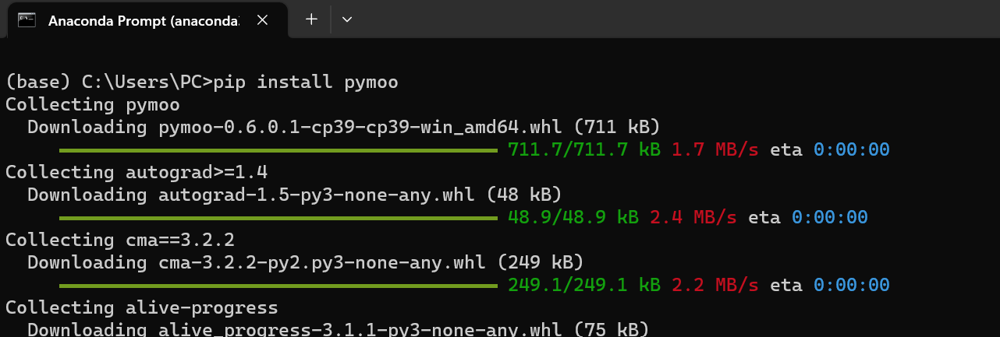
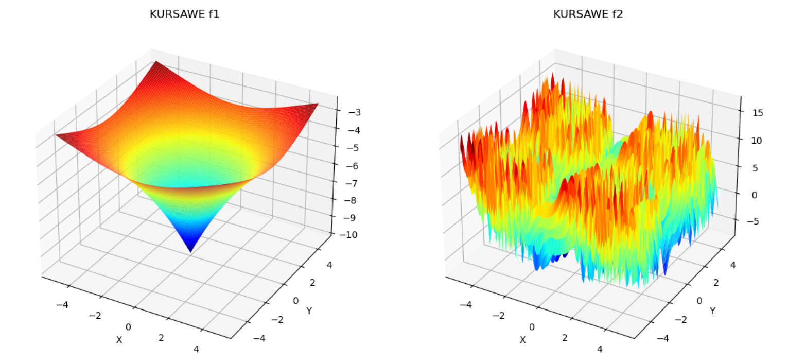
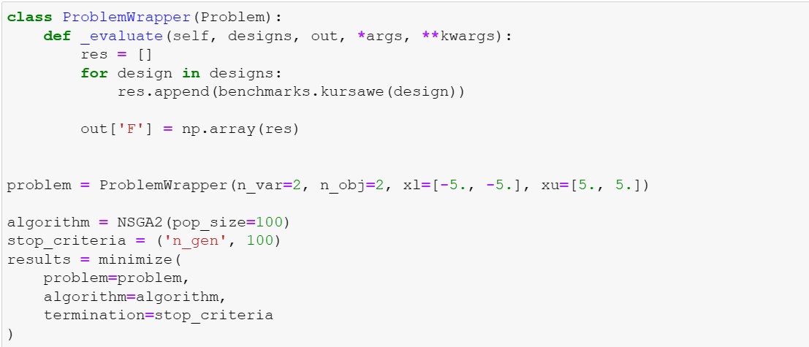
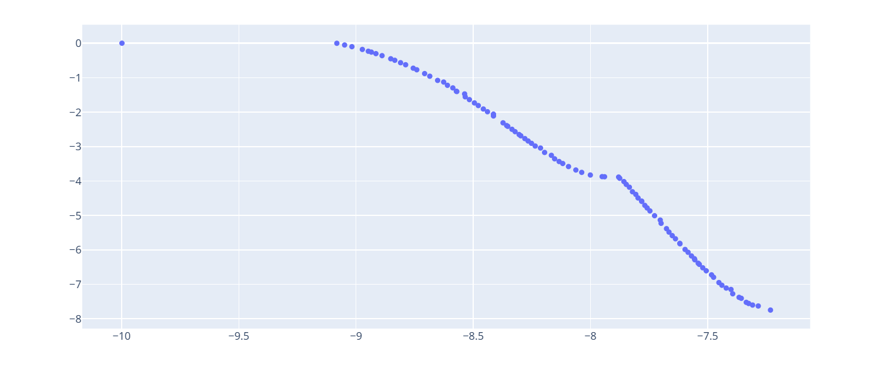

#  :unlock: Pymoo MultiObjective Optimization Python
## :white_check_mark:first example Using NSGA II algorithm 
NSGA II it's an appreviation for Non dominated Sorting genetic Algorithm 
## :camera: Install Pymoo
 |
## :camera: We have two Objectives and two variables 
 |
## :camera: Code python : using pymoo library -for multi-objective optimization- to define the problem 
 |
## :camera: The optimum solutions for the problem 
 |

